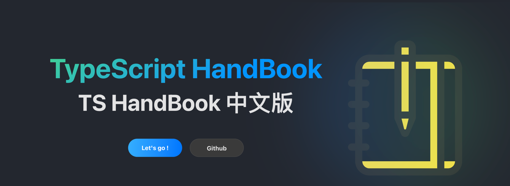

# TypeScript Handbook 中文版

## 简介

本指南的初衷是“扫盲” & 创意式翻译官方的 [`TS HandBook`](https://www.typescriptlang.org/docs/handbook/intro.html)。

有些内容会略微进行删减，只翻译记录干货，尽量聚焦在核心知识点上，各个章节提供代码示例。

本指南如果能对你有所帮助，欢迎在 `GitHub` 为本仓库点一个 `Star`，如果有勘误，欢迎 `Issue` 或者 `PR`。

最后，旅程即将开始，希望你有所收获！

## 致谢

本站的创建离不开以下站点及个人，本站声明不附带任何盈利性质，所有内容一经发布默认进入公共领域，所有内容遵循 `CC0` 协议。

*本站仅供学习交流、欣赏使用。本站不对内容正确性负责，如有勘误可留言交流或者提 `PR` 处理~*

### 站点框架

- [Rspress](https://rspress.dev/)

### 图标来源

- [iconfont.cn](https://www.iconfont.cn/search/index?searchType=icon&q=handbook&page=1&tag=hand)

### 网站托管

- [GitHub Pages](https://github.com/)
- [Cloudflare](https://dash.cloudflare.com)

## LICENSE

@copyright by ryanwang
